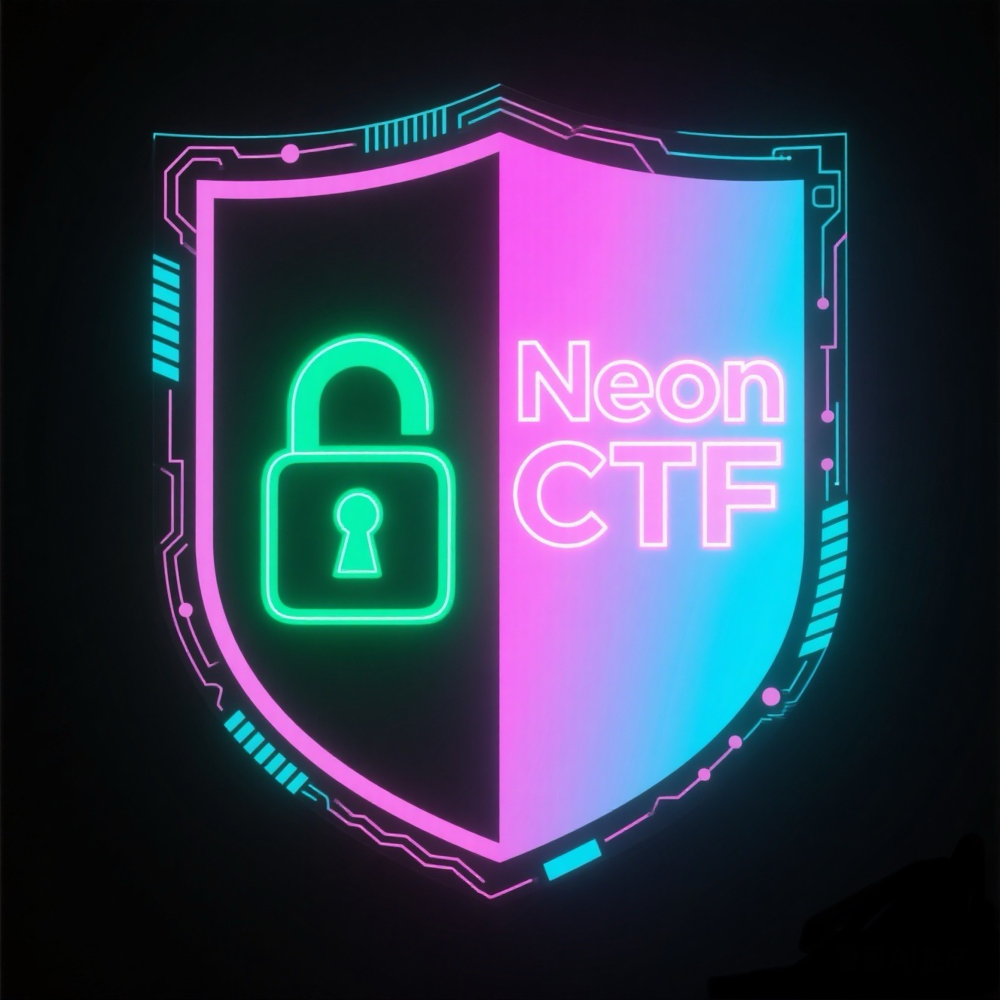

<div align="center">
   
    
   <h1>
    NeonCTF
   </h1>

  <p>
    <a href="./README_CN.md">中文</a>&nbsp<a href="./README.md">EN</a>
  </p>

  <p>A modern Flask-based CTF (Capture The Flag) competition platform with neon night theme design and integrated AI security assistant functionality.</p>
</div>

<div align="center">
  
  
  
  
  
</div>

## Features

### Core Features
- 🎯 **Challenge Management**: Supports multiple challenge types including Web, Crypto, Reverse, Pwn, Forensics, Misc
- 👥 **User Management**: Complete user registration, login, and permission management system
- 🏆 **Leaderboard**: Real-time display of user scores and rankings
- 📊 **Statistics Dashboard**: Detailed user and challenge statistics
- 💡 **Hint System**: Tiered hint functionality with point consumption
- 📎 **Attachment Management**: Support for challenge file uploads and downloads
- 🔐 **Flag Verification**: Secure flag submission and verification mechanism

### AI Security Assistant Features
- 🤖 **Dynamic Scenario Generation**: AI-generated personalized CTF challenges
- ⚔️ **Attack Simulation**: Simulate various network attack scenarios
- 🛡️ **Defense Strategies**: Intelligent defense suggestions and solutions
- 📋 **Capability Assessment**: Automatic analysis of user security skill levels
- 🎓 **Learning Materials**: Personalized security learning content recommendations

## Technology Stack

### Backend
- **Flask**: Lightweight web framework
- **SQLAlchemy**: ORM database operations
- **Flask-Login**: User authentication management
- **Flask-Bcrypt**: Password encryption
- **PyMySQL**: MySQL database connector

### Frontend
- **HTML5/CSS3**: Modern interface design
- **JavaScript**: Interactive functionality implementation
- **Tokyo Night Theme**: Neon night color scheme

### Database
- **MySQL**: Primary database
- **Redis**: Cache and session storage (optional)

### AI Integration
- **DeepSeek API**: DeepSeek model support
- **Qwen API**: Tongyi Qianwen model support
- **Local Models**: Support for locally deployed AI models (recommended: Im-studio)
- **LAN Models**: Support for AI model deployment within LAN

## Installation and Deployment

### Requirements
- Python 3.8+
- MySQL 8.0+

### Quick Installation

1. **Clone the Project**
```bash
git clone https://github.com/Howell-Shinji/NeoCTF.git
cd ctf-platform
```

2. **Create Virtual Environment (Optional)**
```bash
python -m venv venv
source venv/bin/activate  # Linux/Mac
# or
venv\Scripts\activate     # Windows
```
Or using conda:
```bash
conda create -n NeoCTF python=3.10
conda activate NeoCTF
```

3. **Install Dependencies**
```bash
pip install -r requirements.txt
```

4. **Configure Environment Variables**
```bash
cp .env.example .env
# Edit .env file and fill in your configuration
```

5. **Configure Database**
```bash
# Create database
mysql -u root -p -e "CREATE DATABASE ctf_platform CHARACTER SET utf8mb4 COLLATE utf8mb4_unicode_ci;"

# Import database structure
mysql -u root -p ctf_platform < ctf_platform.sql
```

6. **Start Application**
```bash
python app.py
```

### Script Installation

The project provides automated installation scripts:

```bash
chmod +x setup.sh
./setup.sh
```

## AI Model Configuration

Fine-tuned cybersecurity-focused large models are available on Baidu Netdisk: [Lora Fine-tuned Model Series](https://pan.baidu.com/s/5k1vPd-0jB5vk4iUPQJJH1g)

### Supported AI Models

#### Local Models (Recommended: Im-studio)
- **Gemma3-Local** (google/gemma-3-4b)
- **Qwen3-Local** (qwen/qwen3-4b)
- **Deepseek-R1-Local** (deepseek/deepseek-r1-0528-qwen3-8b)
- **Qwen2.5-Omni-Local** (qwen2.5-omni-3b)
- **Qwen2.5-VL-Local** (qwen2.5-vl-3b-instruct)

#### LAN Models
- **Gemma3-LAN**
- **Qwen3-LAN**
- **Deepseek-R1-LAN**
- **Qwen2.5-Omni-LAN**
- **Qwen2.5-VL-LAN**

#### Online APIs
- **Tongyi Qianwen API**
- **DeepSeek API**
- **Other supported AI service provider APIs**

### Local AI Deployment (Im-studio)

#### 1. Install Im-studio

```bash
# Download and install Im-studio
curl -fsSL https://install.im-studio.com | bash

# Or manual download
wget https://github.com/im-studio/releases/latest/download/im-studio-linux-amd64.tar.gz
tar -xzf im-studio-linux-amd64.tar.gz
sudo mv im-studio /usr/local/bin/
```

#### 2. Start Local Model Services

```bash
# Start Gemma3 model
im-studio start gemma3 --port 1234

# Start Qwen3 model
im-studio start qwen3 --port 1235

# Start Deepseek-R1 model
im-studio start deepseek --port 1236

# Start Qwen2.5 Omni version
im-studio start qwen2v1 --port 1237

# Start Qwen2.5 Vision Enhanced version
im-studio start qwen2v1 --port 1238
```

#### 3. Configure Local Model URLs

Configure local model service URLs in `.env` file:

```env
# Local model URLs (configure according to actual ports)
LOCAL_GEMMA3_URL=http://127.0.0.1:1234/v1/chat/completions
LOCAL_QWEN3_URL=http://127.0.0.1:1235/v1/chat/completions
LOCAL_DEEPSEEK_R1_URL=http://127.0.0.1:1236/v1/chat/completions
LOCAL_QWEN25_OMNI_URL=http://127.0.0.1:1237/v1/chat/completions
LOCAL_QWEN25_VL_URL=http://127.0.0.1:1238/v1/chat/completions
```

### LAN AI Deployment

#### 1. LAN Environment Configuration

```bash
# Start model service on LAN server
# Assuming server IP is 192.168.1.108
im-studio start qwen3.0 --host 0.0.0.0 --port 1234

# Ensure firewall allows relevant ports
sudo ufw allow 1234
sudo ufw allow 1235
sudo ufw allow 1236
sudo ufw allow 1237
sudo ufw allow 1238
```

#### 2. Configure LAN Model URLs

Configure LAN model service URLs in `.env` file:

```env
# LAN model URLs (configure according to actual IP and ports)
LAN_GEMMA3_URL=http://192.168.1.108:1234/v1/chat/completions
LAN_QWEN3_URL=http://192.168.1.108:1235/v1/chat/completions
LAN_DEEPSEEK_R1_URL=http://192.168.1.108:1236/v1/chat/completions
LAN_QWEN25_OMNI_URL=http://192.168.1.108:1237/v1/chat/completions
LAN_QWEN25_VL_URL=http://192.168.1.108:1238/v1/chat/completions
```

### Online API Configuration

#### 1. Obtain API Keys

##### Tongyi Qianwen API
1. Visit [Alibaba Cloud Console](https://dashscope.console.aliyun.com/)
2. Enable Tongyi Qianwen service
3. Obtain API key

##### DeepSeek API
1. Visit [DeepSeek Open Platform](https://platform.deepseek.com/)
2. Register account and top up
3. Obtain API key

#### 2. Configure API Keys

Configure API keys in `.env` file:

```env
# Tongyi Qianwen API
QWEN_API_KEY=your_qwen_api_key
QWEN_API_URL=https://dashscope.aliyuncs.com/api/v1/services/aigc/text-generation/generation

# DeepSeek API
DEEPSEEK_API_KEY=your_deepseek_api_key
DEEPSEEK_API_URL=https://api.deepseek.com/chat/completions

# Other API configurations
# OPENAI_API_KEY=your_openai_api_key
# CLAUDE_API_KEY=your_claude_api_key
```

## Configuration Guide

### Basic Configuration

Edit configuration items in [config.py](config.py):

```python
# Database configuration
DATABASE_USER = 'your_db_user'
DATABASE_PASSWORD = 'your_db_password'
DATABASE_HOST = 'localhost'
DATABASE_NAME = 'ctf_platform'

# Security configuration
SECRET_KEY = 'your-secret-key-here'

# File upload configuration
UPLOAD_FOLDER = 'uploads'
MAX_CONTENT_LENGTH = 50 * 1024 * 1024  # 50MB

# AI model configuration
DEFAULT_AI_MODEL = 'Qwen3-Local'  # Default to local Qwen3 model
AI_REQUEST_TIMEOUT = 30  # AI request timeout (seconds)
AI_MAX_RETRIES = 3  # Maximum AI request retries
```

## User Guide

### Administrator Features

1. **Default Administrator Account**
   - Username: `admin`
   - Password: `admin123`

2. **AI Model Management**
   - Visit `/admin_ai` to manage AI model configurations
   - Configure local model service addresses
   - Set API keys and access parameters
   - Monitor model service status

3. **Challenge Management**
   - Visit `/admin/challenges` to manage challenges
   - Support adding, editing, deleting challenges
   - Support file uploads and hint management

4. **User Management**
   - Visit `/admin/users` to manage users
   - Set administrator permissions
   - View detailed user information

5. **AI Management Panel**
   - Visit `/ai_arena` to view AI functionality statistics
   - Manage attack simulations and defense strategies
   - Monitor AI model usage

### Regular User Features

1. **Registration and Login**
   - Visit `/register` to register new account
   - Visit `/login` to log into system

2. **Challenge Solving Process**
   - Browse `/challenges` to view challenges
   - Click challenges to view details
   - Submit flags to earn points

3. **AI Training Arena**
   - Visit `/ai-arena` to use AI security assistant
   - Select appropriate AI models
   - Get defense suggestions and learning materials
   - Conduct capability assessments

## Directory Structure

```
ctf-platform/
├── app.py                 # Main application file
├── config.py             # Configuration file
├── requirements.txt      # Dependency list
├── ctf_platform.sql      # Database structure
├── .env.example         # Environment variable template
├── setup.sh             # Auto installation script
├── start.sh             # Startup script
├── static/              # Static files
│   ├── css/            # Style files
│   └── js/             # JavaScript files
├── templates/           # HTML templates
│   ├── admin/          # Administrator templates
│   └── *.html          # Page templates
├── uploads/            # Upload file directory
└── utils/              # Utility modules
    └── ai_api.py       # AI interface wrapper
```

## Database Design

### Main Table Structure

- **users**: User information table
- **challenges**: Challenge information table
- **categories**: Challenge category table
- **submissions**: Submission record table
- **hints**: Hint information table
- **attachments**: Attachment information table
- **attack_simulations**: Attack simulation table
- **defense_strategies**: Defense strategy table
- **user_evaluations**: User evaluation table
- **ai_models**: AI model configuration table
- **ai_usage_logs**: AI usage log table

For detailed database structure, please refer to [ctf_platform.sql](ctf_platform.sql)

## Deployment Recommendations

### Production Environment Deployment

1. **Use WSGI Server**
```bash
pip install gunicorn
gunicorn -w 4 -b 0.0.0.0:5000 app:app
```

2. **Configure Reverse Proxy**
```nginx
server {
    listen 80;
    server_name your-domain.com;
    
    location / {
        proxy_pass http://127.0.0.1:5000;
        proxy_set_header Host $host;
        proxy_set_header X-Real-IP $remote_addr;
    }
}
```

3. **Security Configuration**
```bash
# Set environment variables
export FLASK_ENV=production
export SECRET_KEY=your-production-secret-key

# Enable HTTPS
export SESSION_COOKIE_SECURE=true
```

### Docker Deployment

The project supports Docker containerized deployment:

```dockerfile
FROM python:3.9-slim

WORKDIR /app
COPY requirements.txt .
RUN pip install -r requirements.txt

COPY . .
EXPOSE 5000

CMD ["gunicorn", "-w", "4", "-b", "0.0.0.0:5000", "app:app"]
```

### AI Model Service Deployment

```bash
# Deploy local AI models using Docker
docker run -d \
  --name im-studio-qwen3 \
  -p 1234:1234 \
  -v ./models:/models \
  im-studio/qwen3.0:latest

# Deploy multiple models using Docker Compose
docker-compose up -d
```

## Troubleshooting

### Common Issues

1. **Database Connection Failed**
   - Check if MySQL service is running
   - Verify database user permissions
   - Confirm firewall settings

2. **File Upload Failed**
   - Check `uploads` directory permissions
   - Verify file size limits
   - Confirm allowed file types

3. **AI Features Not Working**
   - Check if AI model services are running
   - Verify API key configuration
   - Confirm network connection status
   - Check firewall port settings

4. **Local AI Model Not Responding**
   - Check Im-studio service status: `im-studio status`
   - Restart model service: `im-studio restart qwen3`
   - View service logs: `im-studio logs qwen3`
   - Check system resource usage

5. **LAN AI Model Connection Failed**
   - Check network connectivity: `ping 192.168.1.108`
   - Verify port accessibility: `telnet 192.168.1.108 1234`
   - Check firewall settings
   - Confirm server IP address configuration

### Debug Logging

Enable debug mode:

```python
# config.py
DEBUG = True
SQLALCHEMY_ECHO = True  # Show SQL statements
AI_DEBUG = True  # Show AI API call details
```

View AI service logs:

```bash
# View Im-studio logs
im-studio logs qwen3

# View application logs
tail -f app.log

# View AI API call logs
tail -f ai_api.log
```

## Performance Optimization

### AI Model Optimization

1. **Model Selection Recommendations**
   - Lightweight tasks: Gemma3-Local (4B parameters)
   - General tasks: Qwen3-Local (4B parameters, recommended)
   - Complex reasoning: Deepseek-R1-Local (8B parameters)
   - Multimodal tasks: Qwen2.5-VL-Local (Vision Enhanced)
   - Omnipotent tasks: Qwen2.5-Omni-Local (Omni version)

2. **Resource Configuration Recommendations**
   - 4B models: 8GB RAM, 4-core CPU
   - 8B models: 16GB RAM, 8-core CPU
   - Recommended: 32GB RAM, 16-core CPU, GPU support

3. **Caching Strategy**
   - Enable Redis caching for AI responses
   - Set reasonable cache expiration times
   - Implement intelligent cache update mechanisms

## Contributing

1. Fork the project
2. Create feature branch (`git checkout -b feature/AmazingFeature`)
3. Commit changes (`git commit -m 'Add some AmazingFeature'`)
4. Push to branch (`git push origin feature/AmazingFeature`)
5. Create Pull Request

## License

This project is open source under the MIT License. See `LICENSE` file for details.

## Contact

- Project Homepage: [GitHub Repository](https://github.com/Howell-Shinji/NeoCTF.git)
- Issue Reporting: [GitHub Issues](https://github.com/Howell-Shinji/NeoCTF/issues)
- Email: Howell-Bear@outlook.com

---

**Note**: This project is for educational and learning purposes only. Please comply with relevant laws and regulations and do not use it for illegal purposes. The use of AI models must comply with the corresponding terms of service and usage agreements.