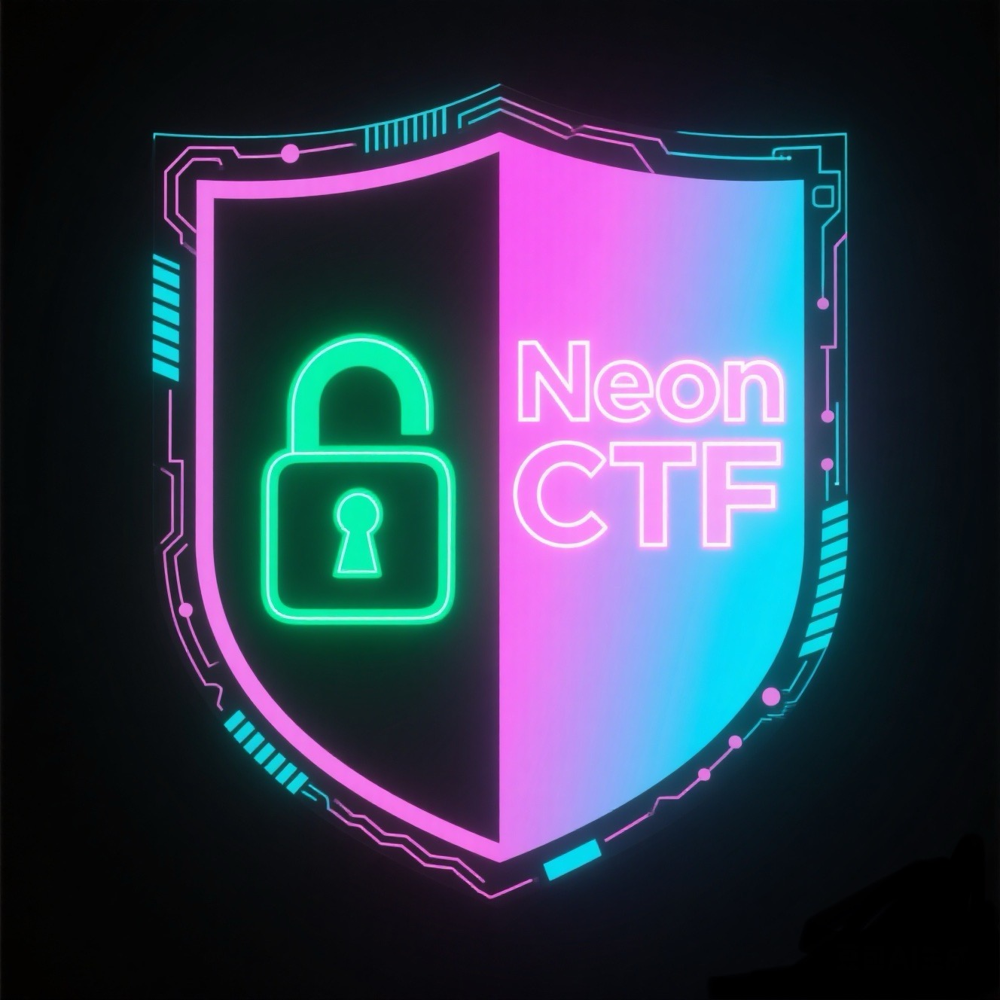

<div align="center">
   
  
   <h1>
      NeonCTF
   </h1>

   <p>
      <a href="./README_CN.md">中文</a>&nbsp<a href="./README.md">EN</a>
   </p>

   <p>一个基于Flask的现代化CTF（Capture The Flag）竞赛平台，采用了霓虹夜主题的界面设计，集成了AI安全助手功能。</p>
</div>

<div align="center">
   
   
   
   
   
</div>

## 功能特性

### 核心功能
- 🎯 **题目管理**: 支持Web、Crypto、Reverse、Pwn、Forensics、Misc等多种题目类型
- 👥 **用户管理**: 完整的用户注册、登录、权限管理系统
- 🏆 **排行榜**: 实时显示用户得分和排名
- 📊 **统计面板**: 提供详细的用户和题目统计信息
- 💡 **提示系统**: 分级提示功能，消耗积分解锁
- 📎 **附件管理**: 支持题目附件上传和下载
- 🔐 **Flag验证**: 安全的Flag提交和验证机制

### AI安全助手功能
- 🤖 **动态场景生成**: 基于AI生成个性化CTF挑战
- ⚔️ **攻击模拟**: 模拟各种网络攻击场景
- 🛡️ **防御策略**: 智能生成防御建议和解决方案
- 📋 **能力评估**: 自动分析用户安全技能水平
- 🎓 **学习资料**: 个性化的安全学习内容推荐

## 技术栈

### 后端
- **Flask**: 轻量级Web框架
- **SQLAlchemy**: ORM数据库操作
- **Flask-Login**: 用户认证管理
- **Flask-Bcrypt**: 密码加密
- **PyMySQL**: MySQL数据库连接器

### 前端
- **HTML5/CSS3**: 现代化界面设计
- **JavaScript**: 交互功能实现
- **Tokyo Night主题**: 霓虹夜色彩搭配

### 数据库
- **MySQL**: 主数据库
- **Redis**: 缓存和会话存储（可选）

### AI集成
- **DeepSeek API**: DeepSeek模型支持
- **Qwen API**: 通义千问模型支持
- **本地模型**: 支持本地部署的AI模型（推荐使用Im-studio）
- **局域网模型**: 支持局域网内AI模型部署

## 安装部署

### 环境要求
- Python 3.8+
- MySQL 8.0+

### 快速安装

1. **克隆项目**
```bash
git clone https://github.com/Howell-Shinji/NeoCTF.git
cd ctf-platform
```

2. **创建虚拟环境（可选）**
```bash
python -m venv venv
source venv/bin/activate  # Linux/Mac
# 或
venv\Scripts\activate     # Windows
```
或使用conda
```bash
conda create -n NeoCTF python=3.10
conda activate NeoCTF
```

3. **安装依赖**
```bash
pip install -r requirements.txt
```

4. **配置环境变量**
```bash
cp .env.example .env
# 编辑 .env 文件，填入您的配置信息
```

5. **配置数据库**
```bash
# 创建数据库
mysql -u root -p -e "CREATE DATABASE ctf_platform CHARACTER SET utf8mb4 COLLATE utf8mb4_unicode_ci;"

# 导入数据库结构
mysql -u root -p ctf_platform < ctf_platform.sql
```

6. **启动应用**
```bash
python app.py
```

### 使用脚本安装

项目提供了自动化安装脚本：

```bash
chmod +x setup.sh
./setup.sh
```

## AI模型配置

微调过的，针对于网络安全的大模型代码可以前往百度网盘获得：[Lora微调大模型系列](https://pan.baidu.com/s/5k1vPd-0jB5vk4iUPQJJH1g)

### 支持的AI模型

#### 本地模型（推荐使用Im-studio）
- **Gemma3-Local** (google/gemma-3-4b)
- **Qwen3-Local** (qwen/qwen3-4b)
- **Deepseek-R1-Local** (deepseek/deepseek-r1-0528-qwen3-8b)
- **Qwen2.5-Omni-Local** (qwen2.5-omni-3b)
- **Qwen2.5-VL-Local** (qwen2.5-vl-3b-instruct)

#### 局域网模型
- **Gemma3-LAN**
- **Qwen3-LAN**
- **Deepseek-R1-LAN**
- **Qwen2.5-Omni-LAN**
- **Qwen2.5-VL-LAN**

#### 在线API
- **通义千问API**
- **DeepSeek API**
- **其他支持的AI服务商API**

### 本地AI部署（Im-studio）

#### 1. 安装Im-studio

```bash
# 下载并安装Im-studio
curl -fsSL https://install.im-studio.com | bash

# 或手动下载
wget https://github.com/im-studio/releases/latest/download/im-studio-linux-amd64.tar.gz
tar -xzf im-studio-linux-amd64.tar.gz
sudo mv im-studio /usr/local/bin/
```

#### 2. 启动本地模型服务

```bash
# 启动Gemma3模型
im-studio start gemma3 --port 1234

# 启动Qwen3模型
im-studio start qwen3 --port 1235

# 启动Deepseek-R1模型
im-studio start deepseek --port 1236

# 启动Qwen2.5全能版
im-studio start qwen2v1 --port 1237

# 启动Qwen2.5视觉增强版
im-studio start qwen2v1 --port 1238
```

#### 3. 配置本地模型URL

在 `.env` 文件中配置本地模型服务URL：

```env
# 本地模型URL（根据实际端口配置）
LOCAL_GEMMA3_URL=http://127.0.0.1:1234/v1/chat/completions
LOCAL_QWEN3_URL=http://127.0.0.1:1235/v1/chat/completions
LOCAL_DEEPSEEK_R1_URL=http://127.0.0.1:1236/v1/chat/completions
LOCAL_QWEN25_OMNI_URL=http://127.0.0.1:1237/v1/chat/completions
LOCAL_QWEN25_VL_URL=http://127.0.0.1:1238/v1/chat/completions
```

### 局域网AI部署

#### 1. 局域网环境配置

```bash
# 在局域网服务器上启动模型服务
# 假设服务器IP为192.168.1.108
im-studio start qwen3.0 --host 0.0.0.0 --port 1234

# 确保防火墙允许相关端口
sudo ufw allow 1234
sudo ufw allow 1235
sudo ufw allow 1236
sudo ufw allow 1237
sudo ufw allow 1238
```

#### 2. 配置局域网模型URL

在 `.env` 文件中配置局域网模型服务URL：

```env
# 局域网模型URL（根据实际IP和端口配置）
LAN_GEMMA3_URL=http://192.168.1.108:1234/v1/chat/completions
LAN_QWEN3_URL=http://192.168.1.108:1235/v1/chat/completions
LAN_DEEPSEEK_R1_URL=http://192.168.1.108:1236/v1/chat/completions
LAN_QWEN25_OMNI_URL=http://192.168.1.108:1237/v1/chat/completions
LAN_QWEN25_VL_URL=http://192.168.1.108:1238/v1/chat/completions
```

### 在线API配置

#### 1. 获取API密钥

##### 通义千问API
1. 访问 [阿里云控制台](https://dashscope.console.aliyun.com/)
2. 开通通义千问服务
3. 获取API密钥

##### DeepSeek API
1. 访问 [DeepSeek开放平台](https://platform.deepseek.com/)
2. 注册账号并充值
3. 获取API密钥

#### 2. 配置API密钥

在 `.env` 文件中配置API密钥：

```env
# 通义千问API
QWEN_API_KEY=your_qwen_api_key
QWEN_API_URL=https://dashscope.aliyuncs.com/api/v1/services/aigc/text-generation/generation

# DeepSeek API
DEEPSEEK_API_KEY=your_deepseek_api_key
DEEPSEEK_API_URL=https://api.deepseek.com/chat/completions

# 其他API配置
# OPENAI_API_KEY=your_openai_api_key
# CLAUDE_API_KEY=your_claude_api_key
```

## 配置说明

### 基础配置

编辑 [config.py](config.py) 文件中的配置项：

```python
# 数据库配置
DATABASE_USER = 'your_db_user'
DATABASE_PASSWORD = 'your_db_password'
DATABASE_HOST = 'localhost'
DATABASE_NAME = 'ctf_platform'

# 安全配置
SECRET_KEY = 'your-secret-key-here'

# 文件上传配置
UPLOAD_FOLDER = 'uploads'
MAX_CONTENT_LENGTH = 50 * 1024 * 1024  # 50MB

# AI模型配置
DEFAULT_AI_MODEL = 'Qwen3-Local'  # 默认使用本地Qwen3模型
AI_REQUEST_TIMEOUT = 30  # AI请求超时时间（秒）
AI_MAX_RETRIES = 3  # AI请求最大重试次数
```

## 使用指南

### 管理员功能

1. **默认管理员账户**
   - 用户名: `admin`
   - 密码: `admin123`

2. **AI模型管理**
   - 访问 `/admin_ai` 管理AI模型配置
   - 配置本地模型服务地址
   - 设置API密钥和访问参数
   - 监控模型服务状态

3. **题目管理**
   - 访问 `/admin/challenges` 管理题目
   - 支持添加、编辑、删除题目
   - 支持附件上传和提示管理

4. **用户管理**
   - 访问 `/admin/users` 管理用户
   - 设置管理员权限
   - 查看用户详细信息

5. **AI管理面板**
   - 访问 `/ai_arena` 查看AI功能统计
   - 管理攻击模拟和防御策略
   - 监控AI模型使用情况

### 普通用户功能

1. **注册登录**
   - 访问 `/register` 注册新账户
   - 访问 `/login` 登录系统

2. **解题流程**
   - 浏览 `/challenges` 查看题目
   - 点击题目查看详情
   - 提交Flag获得积分

3. **AI训练场**
   - 访问 `/ai-arena` 使用AI安全助手
   - 选择合适的AI模型
   - 获取防御建议和学习资料
   - 进行能力评估

## 目录结构

```
ctf-platform/
├── app.py                 # 主应用文件
├── config.py             # 配置文件
├── requirements.txt      # 依赖包列表
├── ctf_platform.sql      # 数据库结构
├── .env.example         # 环境变量模板
├── setup.sh             # 自动安装脚本
├── start.sh             # 启动脚本
├── static/              # 静态文件
│   ├── css/            # 样式文件
│   └── js/             # JavaScript文件
├── templates/           # HTML模板
│   ├── admin/          # 管理员模板
│   └── *.html          # 页面模板
├── uploads/            # 上传文件目录
└── utils/              # 工具模块
    └── ai_api.py       # AI接口封装
```

## 数据库设计

### 主要表结构

- **users**: 用户信息表
- **challenges**: 题目信息表
- **categories**: 题目分类表
- **submissions**: 提交记录表
- **hints**: 提示信息表
- **attachments**: 附件信息表
- **attack_simulations**: 攻击模拟表
- **defense_strategies**: 防御策略表
- **user_evaluations**: 用户评估表
- **ai_models**: AI模型配置表
- **ai_usage_logs**: AI使用日志表

详细的数据库结构请参考 [ctf_platform.sql](ctf_platform.sql)


## 部署建议

### 生产环境部署

1. **使用WSGI服务器**
```bash
pip install gunicorn
gunicorn -w 4 -b 0.0.0.0:5000 app:app
```

2. **配置反向代理**
```nginx
server {
    listen 80;
    server_name your-domain.com;
    
    location / {
        proxy_pass http://127.0.0.1:5000;
        proxy_set_header Host $host;
        proxy_set_header X-Real-IP $remote_addr;
    }
}
```

3. **安全配置**
```bash
# 设置环境变量
export FLASK_ENV=production
export SECRET_KEY=your-production-secret-key

# 启用HTTPS
export SESSION_COOKIE_SECURE=true
```

### Docker部署

项目支持Docker容器化部署：

```dockerfile
FROM python:3.9-slim

WORKDIR /app
COPY requirements.txt .
RUN pip install -r requirements.txt

COPY . .
EXPOSE 5000

CMD ["gunicorn", "-w", "4", "-b", "0.0.0.0:5000", "app:app"]
```

### AI模型服务部署

```bash
# 使用Docker部署本地AI模型
docker run -d \
  --name im-studio-qwen3 \
  -p 1234:1234 \
  -v ./models:/models \
  im-studio/qwen3.0:latest

# 使用Docker Compose部署多个模型
docker-compose up -d
```

## 故障排除

### 常见问题

1. **数据库连接失败**
   - 检查MySQL服务是否启动
   - 验证数据库用户权限
   - 确认防火墙设置

2. **文件上传失败**
   - 检查 `uploads` 目录权限
   - 验证文件大小限制
   - 确认文件类型允许

3. **AI功能无法使用**
   - 检查AI模型服务是否启动
   - 验证API密钥配置
   - 确认网络连接状态
   - 检查防火墙端口设置

4. **本地AI模型无响应**
   - 检查Im-studio服务状态: `im-studio status`
   - 重启模型服务: `im-studio restart qwen3`
   - 查看服务日志: `im-studio logs qwen3`
   - 检查系统资源使用情况

5. **局域网AI模型连接失败**
   - 检查网络连通性: `ping 192.168.1.108`
   - 验证端口开放: `telnet 192.168.1.108 1234`
   - 检查防火墙设置
   - 确认服务器IP地址配置

### 日志调试

启用调试模式：

```python
# config.py
DEBUG = True
SQLALCHEMY_ECHO = True  # 显示SQL语句
AI_DEBUG = True  # 显示AI API调用详情
```

查看AI服务日志：

```bash
# 查看Im-studio日志
im-studio logs qwen3

# 查看应用日志
tail -f app.log

# 查看AI API调用日志
tail -f ai_api.log
```

## 性能优化

### AI模型优化

1. **模型选择建议**
   - 轻量级任务: Gemma3-Local (4B参数)
   - 通用任务: Qwen3-Local (4B参数，推荐)
   - 复杂推理: Deepseek-R1-Local (8B参数)
   - 多模态任务: Qwen2.5-VL-Local (视觉增强版)
   - 全能任务: Qwen2.5-Omni-Local (全能版)

2. **资源配置建议**
   - 4B模型: 8GB RAM, 4核CPU
   - 8B模型: 16GB RAM, 8核CPU
   - 推荐配置: 32GB RAM, 16核CPU, GPU支持

3. **缓存策略**
   - 启用Redis缓存AI响应
   - 设置合理的缓存过期时间
   - 实现智能缓存更新机制

## 贡献指南

1. Fork 项目
2. 创建功能分支 (`git checkout -b feature/AmazingFeature`)
3. 提交更改 (`git commit -m 'Add some AmazingFeature'`)
4. 推送到分支 (`git push origin feature/AmazingFeature`)
5. 创建 Pull Request

## 许可证

本项目基于 MIT 许可证开源。详情请参阅 `LICENSE` 文件。

## 联系方式

- 项目主页: [GitHub Repository](https://github.com/Howell-Shinji/NeoCTF.git)
- 问题反馈: [GitHub Issues](https://github.com/Howell-Shinji/NeoCTF/issues)
- 邮箱: Howell-Bear@outlook.com

---

**注意**: 本项目仅用于教育和学习目的，请遵循相关法律法规，不得用于非法用途。AI模型的使用需要遵守相应的服务条款和使用协议。